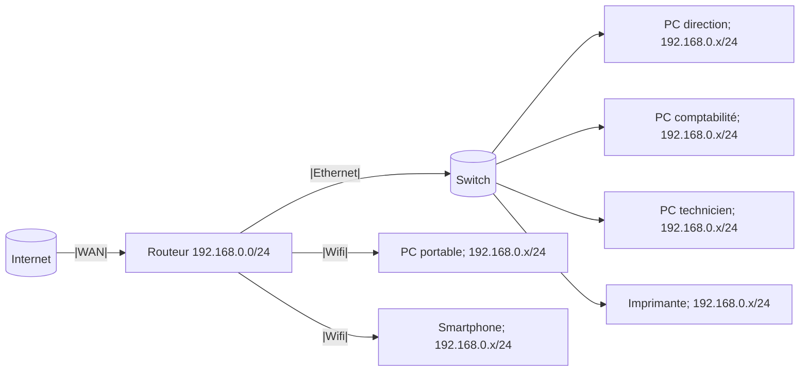
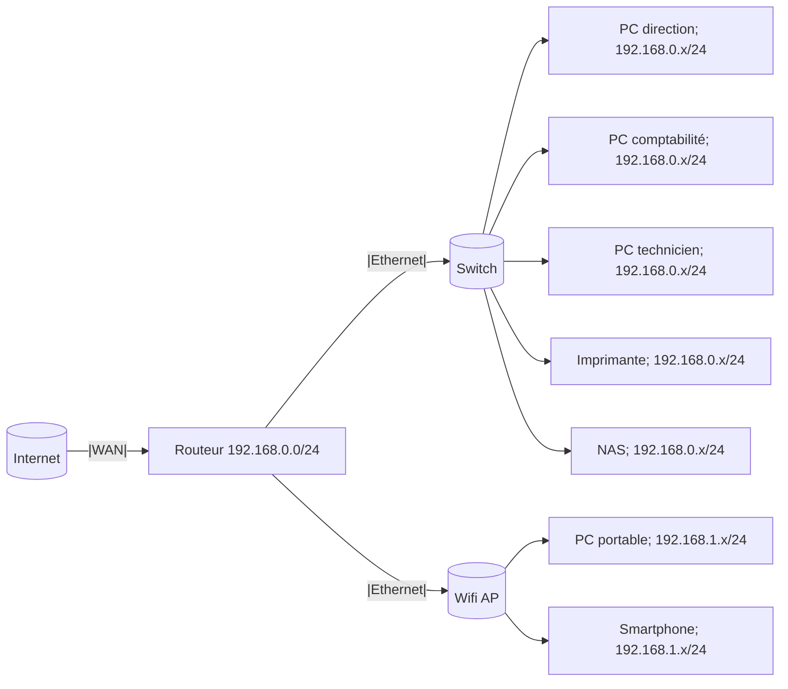
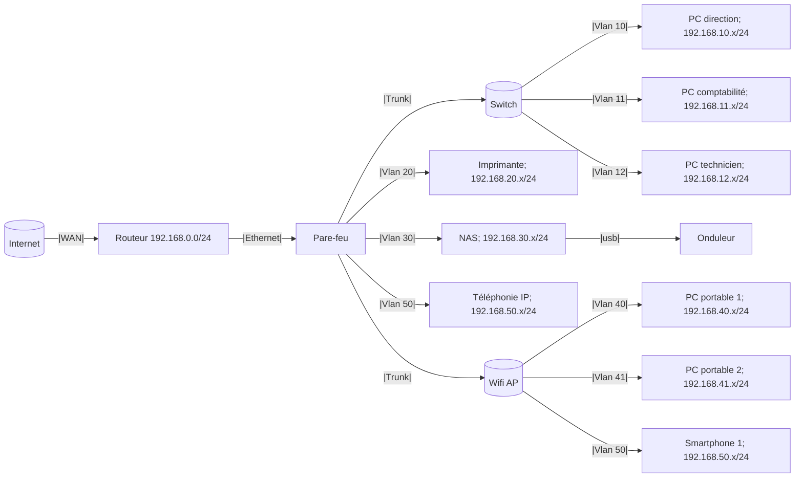

Cet article propose une réflexion sur les architectures réseaux typiques observées selon la taille et la structure des entreprises. L’objectif est d’énumérer les meilleures pratiques ainsi que les priorités en matière de sécurité, tout en tenant compte des contraintes économiques et des niveaux de qualification du personnel. Ce contenu vise à fournir des propositions pour la sécurisation des infrastructures réseau, en équilibrant efficacité, coûts et compétences disponibles.

il est soumis à évolution.

[Réseau TPE](#réseau-tpe)  
[Réseau petite PME](#hypothèse-petite-pme)  
[réseau PME structuré](#hypothèse-pme-structuré)

# Réseau TPE

Cas d’une petite entreprise disposant de quelques salariés, dont la majorité utilise des postes fixes.
L’infrastructure informatique a été constituée de manière progressive, au gré des besoins, par un employé ne disposant pas de compétences spécialisées en IT.
- Les postes de travail sont des PC OEM non configurés spécifiquement, avec uniquement les mises à jour automatiques activées.
- Une imprimante réseau est en place, assortie d’un contrat de fourniture de consommables.
- La connexion internet repose sur un abonnement grand public, sans option de support dédié ni garanties de service.
- Le matériel est ancien et entreposé dans une salle annexe, accessible à l’ensemble du personnel.

Contexte matériel:
- routeur générique
- wifi opérateur
- réseau cablé
- switch unique non administrable
- une imprimante réseau
- un poste direction
- un poste comptable
- un poste par service supplémentaire
- webmail opérateur ou gmail
- backup local sur poste
- téléphonie routeur / Smartphone perso

## Proposition d'évolutions

- configuration routeur FAI
  - réservation baux DHCP
  - wifi passphrase complexe
  - DNS personnalisé, ex. opendns
- pare-feu all-in-one
- wifi AP dédié
- Backup sur deux formats différents local/externe
- Vérouiller les postes avec mot de passe complexe
  
---
 

# Réseau PME

## Hypothèse petite PME

Entreprise d’une dizaine de salariés, équipée d’un parc mixte avec majorité de postes fixes.
- L’infrastructure informatique s’est développée progressivement, selon les besoins, et a été mise en place par un collaborateur disposant de connaissances limitées en IT.
- Postes de travail : PC OEM verouillé, configurés uniquement pour les mises à jour automatiques.
- Impression : une imprimante réseau installée en interne par un employé.
- Connexion Internet : abonnement professionnel incluant une garantie de temps de rétablissement (GTR).- - - Réseau sans fil : point d’accès Wi-Fi de type grand public.
- Stockage : NAS grand public servant de partage réseau pour les différents services, sans gestion des droits d’accès.
- Salle serveur : matériel informatique regroupé dans une pièce annexe, accessible librement à tous les employés.

Contexte matériel:
- ~~routeur générique~~
- **NOUVEAU :** routeur opérateur pro
- ~~wifi routeur opérateur~~
- **NOUVEAU :** wifi AP dédié
- réseau cablé
- switch unique non administrable
- imprimante réseau
- un poste par service
- webmail opérateur ou gmail
- backup clé usb
- **NOUVEAU :** un NAS grand public
- téléphonie routeur / Smartphone perso

## Proposition d'évolution

- pare-feu all-in-one + contrat E.S.N.
- switch administrable
  - vlan
    - isolation par services
    - isolation imprimantes
    - isolation client wifi
    - isolation administration switch / wifi AP
- configuration NAS
  - AGDLP, un répertoire par service
- NAS dimensionné
- politique de sauvegarde externe
- onduleur non administré
- politique de mots de passe

---
 

## Hypothèse PME structuré

Entreprise d’une dizaine de salariés, équipée d’un parc mixte comprenant des postes fixes et des ordinateurs portables.
- L’infrastructure informatique s’est développée progressivement. Tous les équipements ont été installé par une E.S.N. selon les besoins.
- Postes de travail : Politique de mots de passe fixe
- Equipements réseaux configurés en vlan
- Stockage : NAS configuré, partages réseaux avec droits type AGDLP
- téléphonie IP type contrat Teams
- Salle serveur privative avec baie informatique dédié. Pas de contrôle d'accès.

Contexte matériel:
- routeur opérateur pro
- **NOUVEAU :** pare-feu all-in-one
- ~~switch unique non administrable~~
- **NOUVEAU :** switch administrable
- réseau cablé
- ~~wifi routeur opérateur~~
- multi wifi AP
- multi imprimantes réseaux
- un poste par service
- webmail opérateur ou gmail
- ~~backup clé usb~~
- ~~un NAS grand public~~
- **NOUVEAU :** NAS dimensionné
- **NOUVEAU :** onduleur non administré
- **NOUVEAU :** personnel IT ESN
- **NOUVEAU :** baie IT dédié
- ~~téléphonie routeur / Smartphone perso~~
- **NOUVEAU :** téléphonie IP
- **NOUVEAU :** Smartphone partagé perso/pro

Représentions simplifié, l'adminstration swith et wifi AP sont sur un vlan isolé  

## Proposition d'évolution

- Solution unifié type O365 entreprise
- personnel IT dédié
- poste admin dédié chiffré
- serveur windows
  - Active Directory
  - Politique mots de passe renforcé
  - partages réseaux
- Plan de sauvegarde interne
- Politique de mises à jour
- Politique de nommage, réservation IP

---
 
